# Learning CI/CD
- [Learning CI/CD](#learning-cicd)
  - [What is CI? Benefits?](#what-is-ci-benefits)
  - [What is CD? Benefits?](#what-is-cd-benefits)
  - [Difference between CD and CDE](#difference-between-cd-and-cde)
  - [What is Jenkins?](#what-is-jenkins)
    - [Why Use Jenkins?](#why-use-jenkins)
    - [Benefits of Jenkins](#benefits-of-jenkins)
    - [Disadvantages of Jenkins](#disadvantages-of-jenkins)
    - [Stages of Jenkins](#stages-of-jenkins)
    - [What alternatives are there for Jenkins](#what-alternatives-are-there-for-jenkins)
  - [Why build a pipeline? Business value?](#why-build-a-pipeline-business-value)
  - [Diagram of CI/CD](#diagram-of-cicd)
- [CI / CD pipeline](#ci--cd-pipeline)
  - [Why build a CI/CD pipeline?](#why-build-a-cicd-pipeline)
  - [Why Jenkins?](#why-jenkins)
  - [Buniness value?](#buniness-value)
- [Jenkins](#jenkins)
  - [Log in into Jenkins](#log-in-into-jenkins)
  - [Create a new job(or + New Item)](#create-a-new-jobor--new-item)
  - [Configure:](#configure)
  - [Run the project](#run-the-project)
  - [Link two projects](#link-two-projects)
- [Jenkins CI CD pipeline with 3 jobs](#jenkins-ci-cd-pipeline-with-3-jobs)
- [Job 1](#job-1)
  - [Steps to create a SSH to connect the Jenkins server](#steps-to-create-a-ssh-to-connect-the-jenkins-server)
    - [Git + GitHub](#git--github)
    - [Jenkins](#jenkins-1)
  - [Webhook](#webhook)
  - [Change the main branch to dev branch to trigger the webhook](#change-the-main-branch-to-dev-branch-to-trigger-the-webhook)
  - [Job 2](#job-2)
  - [Job 2 using Git Publisher](#job-2-using-git-publisher)
  - [Job 3](#job-3)
    - [In AWS](#in-aws)
    - [In Jenkins](#in-jenkins)

## What is CI? Benefits?
 
**CI (Continuous Integration)**: A development practice where developers integrate code into a shared repository frequently.
 
**Benefits**: Early bug detection, reduced integration issues, improved collaboration, and faster feedback loops.
 
## What is CD? Benefits?
 
**CD (Continuous Deployment/Delivery)**: Automates deployment processes to ensure that code changes are automatically prepared or deployed to production.
 
**Benefits**: Accelerated release cycles, reduced manual intervention, consistent deployment processes, and faster time-to-market.
 
## Difference between CD and CDE
 
**CD (Continuous Delivery)**: Prepares code for release but may require manual approval for deployment.
 
**CDE (Continuous Deployment)**: Automates deployment to production without manual steps.
 
## What is Jenkins?
 
**Jenkins**: An open-source automation tool for CI/CD pipelines, supporting plugins to build, test, and deploy applications.
 
### Why Use Jenkins?
 
* **Automation of CI/CD**: Jenkins automates repetitive tasks in the CI/CD process, reducing the chance of human error and speeding up software delivery.
* **Open-source with Community Support**: Jenkins is free to use and has a large, active community, making it easier to find resources, tutorials, and plugins.
* **Flexible and Extensible**: With hundreds of plugins, Jenkins can be customized to fit a wide range of project needs and integrate with various tools, such as Git, Maven, Docker, and Kubernetes.
* **Scalability**: Jenkins can scale to accommodate large, complex projects by distributing workloads across multiple nodes.
 
 
### Benefits of Jenkins
 
* **Automation**: Saves time by automating the entire CI/CD pipeline, from code commit to deployment.
* **Flexibility through Plugin**s: Jenkins has over 1,800 plugins, allowing integration with almost any tool in the development and deployment process.
* **Scalability**: Supports distributed builds across multiple machines, ideal for large projects.
* **Continuous Monitoring**: Allows for constant feedback on code quality and deployment status, enabling faster and more reliable releases.
 
### Disadvantages of Jenkins
 
* **Complexity**: Setting up and managing Jenkins can be complex, especially for teams new to CI/CD.
 
* **Plugin Management Overhead**: With many plugins available, ensuring compatibility and managing plugin updates can be time-consuming.
 
* **Resource-Intensive**: Jenkins can be resource-heavy, especially when running large numbers of builds or supporting complex pipelines.
 
### Stages of Jenkins
 
**Stages**: Code, Build, Test, Deploy.
 
### What alternatives are there for Jenkins
 
**Alternatives**: GitLab CI/CD, CircleCI, Travis CI, GitHub Actions, Bamboo.
 
## Why build a pipeline? Business value?
 
**Pipeline Benefits**: Streamlines development, ensures quality, reduces errors, enables faster and reliable software delivery, and aligns with agile business needs.
 
## Diagram of CI/CD
 
**Diagram Elements**: Code → Build → Test → Release → Deploy → Monitor.
 
*Understand SDLC workflow: plan, design, develop, deploy*
 
**SDLC Workflow**: Sequential phases where requirements are planned, solutions designed, software developed, and then deployed to production, ensuring systematic development.


# CI / CD pipeline

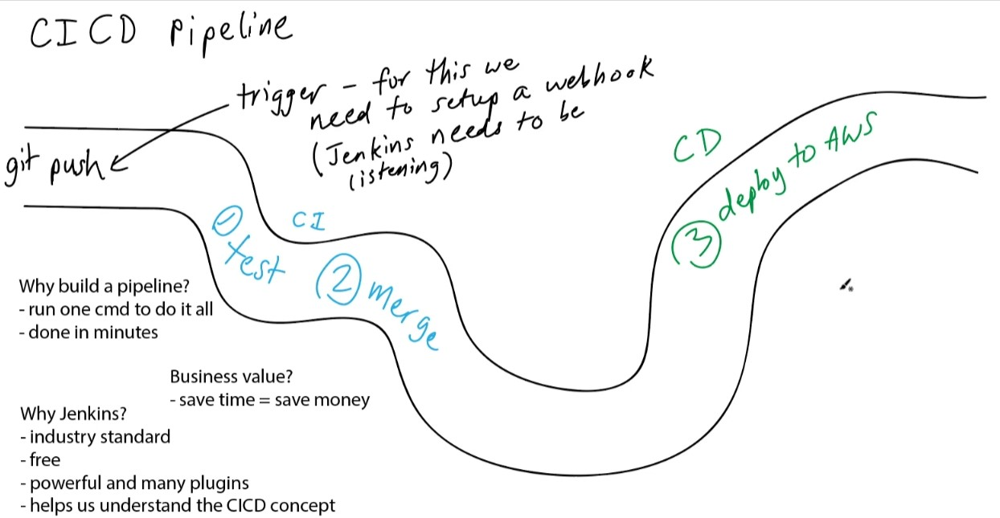


## Why build a CI/CD pipeline?
- run one command to do it all
- done in minutes

## Why Jenkins?
- industry standard (been in indrustry for a while)
- free to use
- open source
- powerful and many plugins 
- help us to understand the CI/CD pipeline

## Buniness value?
- save time -> save money


# Jenkins 


## Log in into Jenkins
 
1. Having a server already set up with the **user name** and **passord** 
2. Log in with the username and passord

    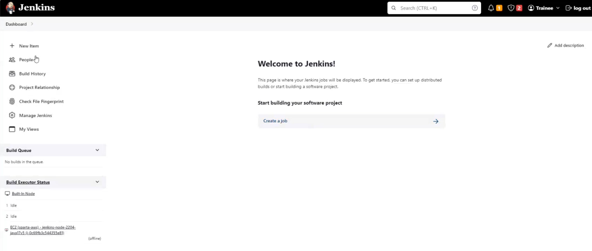


## Create a new job(or + New Item)

1. Click on the **Create a new job** 
   
    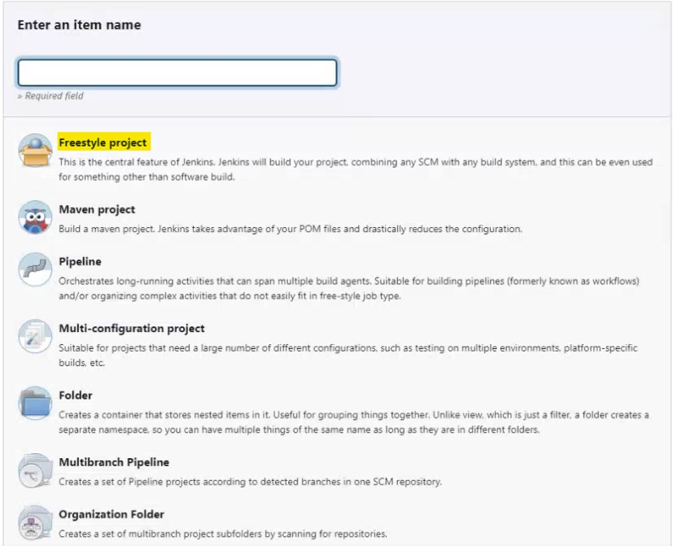

2. **Enter a item name** : `maria-first-project`
   
3.  Select **Freestyle project** then click **OK**
  
## Configure:

  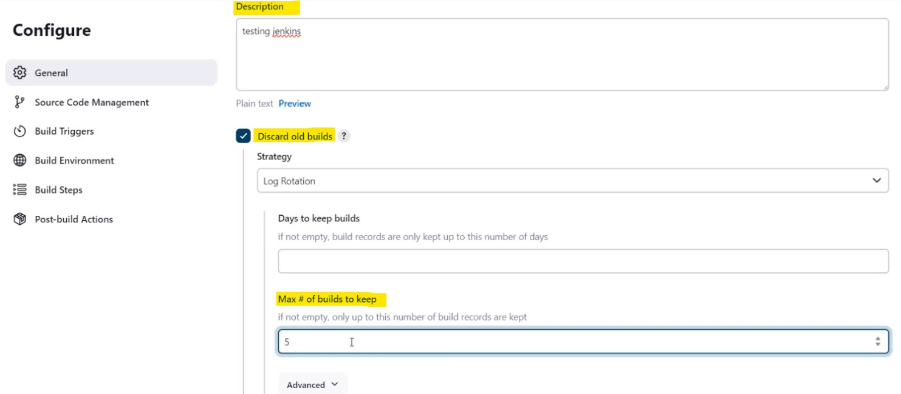
 
1. **Description** : testing jenkins
2. **Enable Discard old builds**
3. **Max # of builds to keep** : `5` 
   
4. **Build Steps**
   - **click build steps**
  
      
  
    - **select execute shell**

      

    - uname -a 
  
      

    - save

## Run the project

1. Click on **Build Now**

    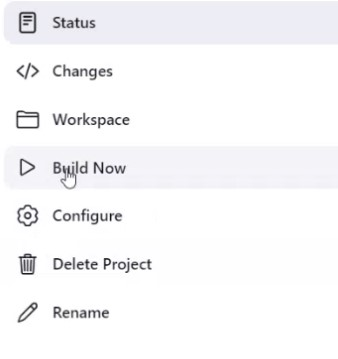

2. After running the job is going to appear in **pending **

    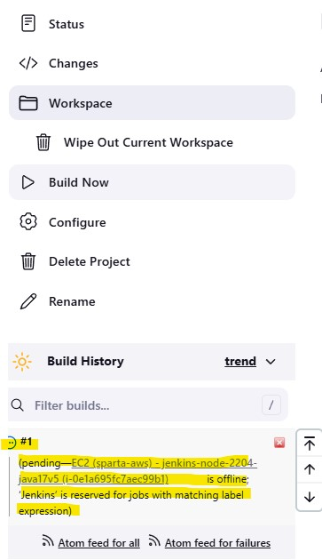

3. To see the job -> **Dashboard**
 
    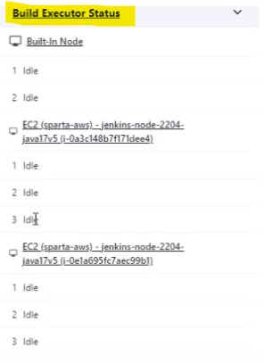

4. If is **successful** -> need to see a **sun**

    

5. To access the **console** 
   - **Build History**
  
      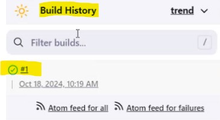

    - Click the **#1**
  
      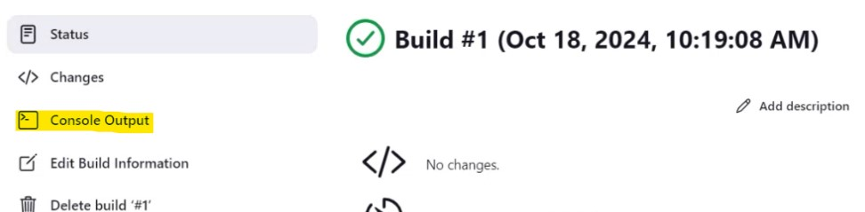

    - **console output**

      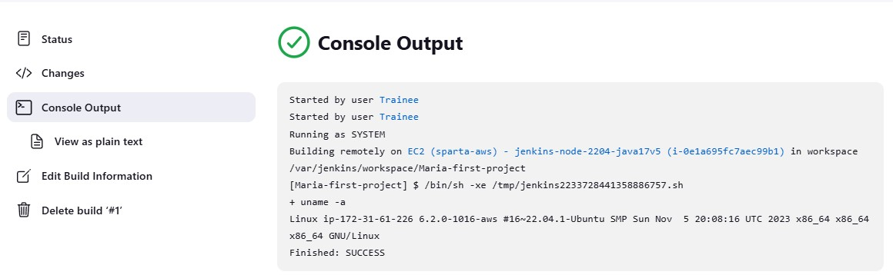

## Link two projects 

1. Create another project
2. Navigate to the previous project
3. Click configure 
4. Nagivate to **Post-build Actions**
  
    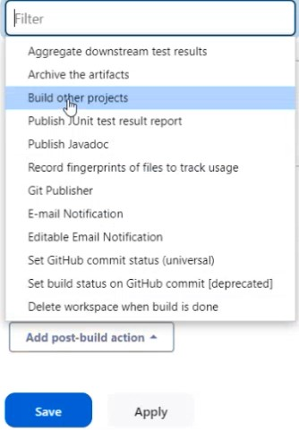

5. Enter your project(in our case the second project)
   
    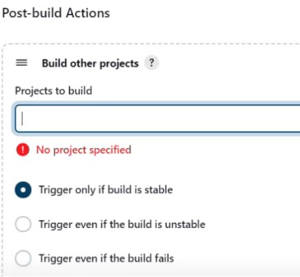

6. **Build now**
   
    


# Jenkins CI CD pipeline with 3 jobs

  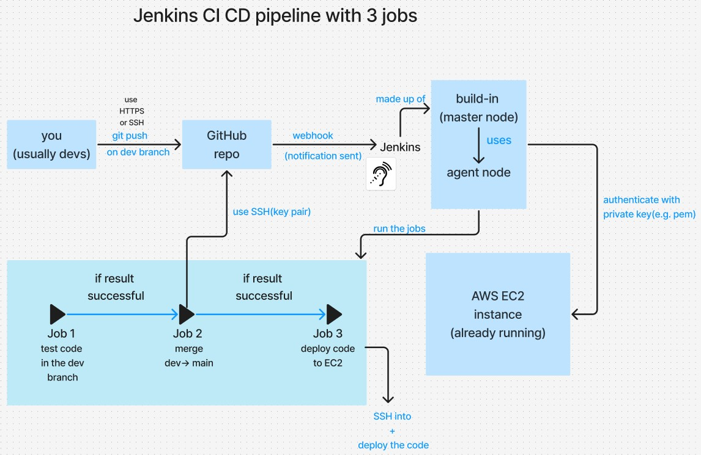

  

# Job 1
## Steps to create a SSH to connect the Jenkins server 
### Git + GitHub

1. In **git bash** -> Generate a **new key**
```bash
ssh-keygen -t rsa -b 4096 -c "<email>"
```
2. **Name the key** : maria-jenkins-2-github-app
3. Create a **new GitHub repo** and connect it locally too
4. Display the public key and copy it 
```bash
cat <public key>
```
5. In **GitHub** -> go to **the repo created**
 
   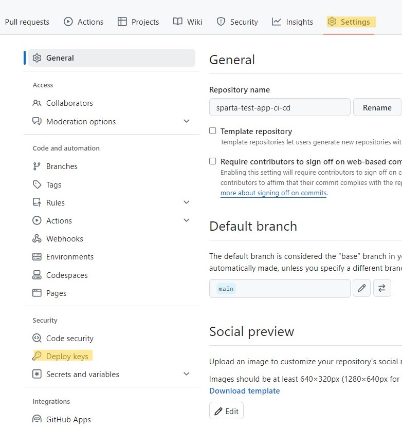

6. **Settings**
7. **Deploy keys** 
8. **Add key**
   
    

9.  Paste the <public key>
10. **ADD**

### Jenkins

1. **New item**
2. **Enter an item name** : tech263-maria-job1-ci-test
3. **Configure**:
   1. *Description*
   2. *Discard old builds* : 5
   3. Click GitHub project
   
      

   4. *Source Code* :
   
      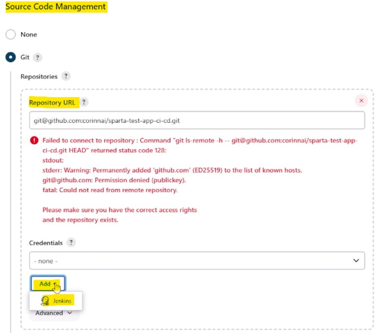

   5. *Add Jenkins Credentials*

      

       1. For the private key : **cat <private key>** -> **copy** and **paste**
   
    6. *Enable Provide Node & npm*
   
        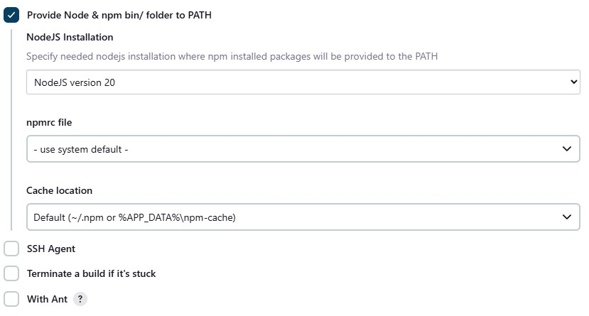
    
    7. *Build Steps*
      
        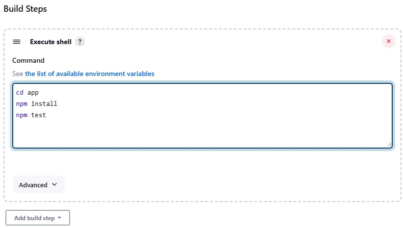
    
    8. *Build Now*


## Webhook

1. *In GitHub navigate to Settings -> WebHook*
   
   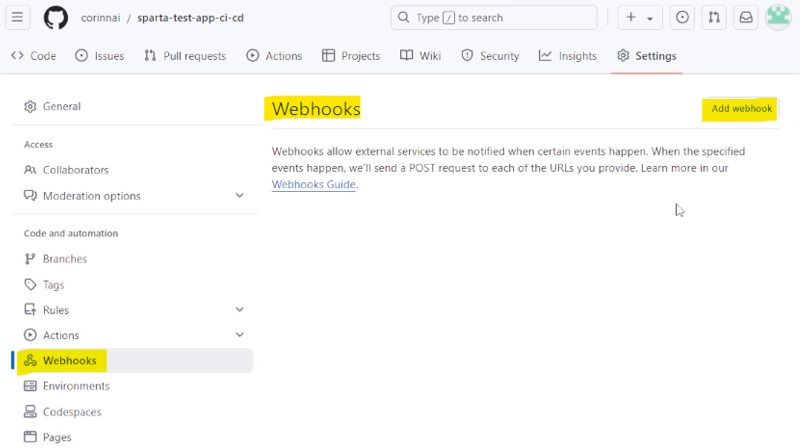

2. *Click Add webhook*

    

    - *the http://52.31.15.176:8080 - Jenkins Server*


## Change the main branch to dev branch to trigger the webhook

1. *In Jenkins change the branch from main to dev*
2. *Enable GitHub hook trigger for GITScm polling*

    

3. *In GitHub* :
   1. Navigate to the repo
   2. Create a branch dev : `git branch dev`
   3. Switch to the dev branch : `git switch dev`
   4. Add readme : `nano README.md`
   5. Push the changes : `git push --set-upstream origin dev`


## Job 2

1. Create a **new project**, following previous steps such as providing **GitHub** repo links and selecting your **SSH** key.
   
2. Add a **build step**, with the following commands inside:
 
```bash
git switch main
git merge origin/dev
git push origin main
```
 
These commands will switch the branch to the main (since we're working in the dev branch), merge the dev changes to the main branch and then push it to the GitHub repo.


## Job 2 using Git Publisher

1. Remove the **Execute Shell**
2. In **Post-build Action** -> Select **Git Publisher**

    


## Job 3

### In AWS
1. Create an **EC2 instance**
2. Select **Ubuntu 22.4LTS**
3. Instance type : **t2.micro**
4. Key pair : already created one : **tech264-maria-aws-key**
5. Networking settings : already created **nsg-rule : tech264-maria-app-allow-HTTP-SSH**
6. Advanced : **user data**
```bash
#!/bin/bash

# Check for updates
echo "update sources list..."
sudo apt update -y
echo "update complete"

# Upgrades those checks
echo "upgrade any packages available..."
sudo DEBIAN_FRONTEND=noninteractive apt upgrade -y
echo "upgrade complete"

# Install nginx
sudo apt install -y nginx
echo "nginx installed"

# Modify Nginx configuration to set up reverse proxy
sudo sed -i 's|try_files $uri $uri/ =404;|proxy_pass http://localhost:3000;|' /etc/nginx/sites-available/default
echo "Nginx reverse proxy configuration updated"

# Test the Nginx configuration
sudo nginx -t

# Restart Nginx
sudo systemctl restart nginx
echo "Nginx restarted with reverse proxy"

echo "install nodejs v20..."
curl -fsSL https://deb.nodesource.com/setup_20.x | sudo -E bash - &&\
sudo DEBIAN_FRONTEND=noninteractive apt-get install -y nodejs

echo "check nodejs version..."
node -v
echo "nodejs v20 installed"

# Install pm2 globally
sudo npm install -g pm2

# Cloning Git repo
echo "Clone Git folder"
git clone https://github.com/corinnai/tech264-sparta-app.git repo
echo "Cloned tech264-sparta-app"

echo "Change directory to app"
cd repo/app
echo "In app directory"

# Stop all existing pm2 processes
pm2 stop all

echo "install and run"
npm install
echo npm "install done"


echo "start"
pm2 start app.js
echo "App started with pm2"
```
7. Launch the instance 

### In Jenkins
1. Create a new item : **maria-job3-cd-deploy**
   
2. Configuration:
   1. Description : <give a description>
   2. **Enable discard old builds** : In **Max # of builds to keep** : `5`
   3. **GitHub project** : `Project url` : `https://github.com/corinnai/sparta-test-app-ci-cd.git/`
   4. **Source Code Management** -> 
      * **Repository URL**: `git@github.com:corinnai/sparta-test-app-ci-cd.git`
      * **Credentials** : maria-jenkins-2-github-app(to read/write to repo)

      * **Branches to build** -> **Branch Specifier** : `*/dev`
    5. **Build Environment** 
        1. **SSH Agent** -> **Credentials**
        2. **Add** 
        3. **Display the AWS private key** and **copy paste into Jenkins** 
      
            

        4. After creating **select our specific credentials**

            


    6. **Build Steps** -> Execute shell
      ```bash
      rsync -avz -e "ssh -o StrictHostKeyChecking=no" app ubuntu@<public EC2 IP address>:~
      ssh -o StrictHostKeyChecking=no ubuntu@<public EC2 IP address> << EOF
          pm2 stop all
          cd app
          npm install
          pm2 start app.js
      EOF
      ```

After stopping the instance and want to run it again and test the 3 jobs if they are working:

1. SSH into the instance :
```bash
ssh -i "~/.ssh/<private aws key>" ubuntu@ec2-<public ip address>.eu-west-1.compute.amazonaws.com
```
2. 
```bash
ls
```
3. 
```bash
cd app
```
4. 
```bash
pm2 start app.js
```
5. Test the jobs and the trigger 
     1. Navigate to the locat repositories 
     2.
     ```bash
     cd into : sparta-test-app-ci-cd
     ``` 
     3. 
     ```bash
      cd app
     ```
     4. 
     ```bash
     cd views
     ```
     5. 
     ```bash
     nano index,ejs
     ```
     6. add a h2 or text inside the index.ejs
     7. 
     ```bash
     git add .
     ```
     8. 
     ```bash
     git commit
     ```
     9. 
     ```bash
     git push
     ```